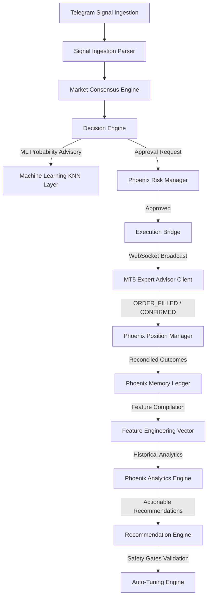

# Forex Consensus Dashboard & Phoenix Automated Trading Engine

A premium, state-of-the-art automated trading system and real-time consensus dashboard. The platform ingests trading signals from Telegram channels, analyzes market bias using a deterministic Decision Engine, performs instance-based machine learning classifications, enforces strict risk check pipelines, and executes demo orders on MT5 terminals.

---

## System Architecture



### Core Phoenix Modules

1. **Phoenix Trade Memory (Phase Φ.1)**:
   - Registers complete, immutable transaction records to a read-only MongoDB database ledger.
2. **Feature Engineering Engine (Phase Φ.2)**:
   - Translates raw transaction histories into structured 37-column numerical vectors.
3. **Phoenix Analytics Engine (Phase Φ.3)**:
   - Computes HSL performance medians, pips distributions, and standard deviations across customizable timeframes.
4. **Recommendation Engine (Phase Φ.4)**:
   - Generates advisory configuration adjustments with automated duplicate/conflict resolution.
5. **Safe Auto-Tuning Engine (Phase Φ.5)**:
   - Validates recommendation objects against 7 strict safety gates (confidence, observations, stability) to formulate Human-Review proposals.
6. **Machine Learning Intelligence Layer (Phase Φ.6)**:
   - Performs instance-based KNN similarity search to attach success probability rates onto active opportunities.
7. **Position Manager (Phase 2)**:
   - Automates risk tightening (Break Even SL, Trailing stop, 50% lot Partial TP, Time/Market exits) and waits for MT5 broker feedback before saving states.
8. **Risk Manager (Phase 3)**:
   - Runs trade requests through a 9-gate safety pipeline (spreads, lot bounds, margins, daily limits) upstream of the Execution Bridge.
9. **Recovery Manager (Phase 4)**:
   - Re-syncs states on boot, coordinates terminal reconnects, and purges zombie orders from MT5.

---

## Directory Structure

- `src/`: React frontend client dashboard application.
- `backend/`: Express server codebase:
  - `src/config/`: Configuration policies (ML, Risk, Position, Recovery).
  - `src/models/`: Append-only Mongoose schemas.
  - `src/services/`: Pipeline logic, execution adapters, and sync helpers.
  - `src/scripts/`: Verification regression scripts.
- `FxDeskBridgeEA.mq5`: MetaTrader 5 Expert Advisor client connector.

---

## Setup & Configuration

### Prerequisites
- Node.js (v20+ recommended)
- MongoDB Database

### Backend Setup
1. Navigate to the backend directory:
   ```bash
   cd backend
   ```
2. Copy the environment template:
   ```bash
   cp .env.example .env
   ```
3. Fill in your configurations inside `.env` (Telegram credentials, MongoDB URI, Gemini Key).
4. Install dependencies:
   ```bash
   npm install
   ```
5. Launch the backend server:
   ```bash
   npm start
   ```

### Frontend Setup
1. From the project root, install frontend dependencies:
   ```bash
   npm install
   ```
2. Build the production client bundle:
   ```bash
   npm run build
   ```
3. Launch the development server:
   ```bash
   npm run dev
   ```

---

## Running Verification Tests

Phoenix includes a robust regression test suite. To run the validation scripts, navigate to the `backend` folder and run the command:

```bash
# General Engine Tests
node src/scripts/testPhoenixMemory.js
node src/scripts/testPhoenixFeatureEngine.js
node src/scripts/testPhoenixAnalytics.js
node src/scripts/testPhoenixRecommendationEngine.js
node src/scripts/testPhoenixAutoTuning.js
node src/scripts/testPhoenixMachineLearning.js

# Operational Service Tests
node src/scripts/testPositionManager.js
node src/scripts/testRiskManager.js
node src/scripts/testRecoveryManager.js
```
