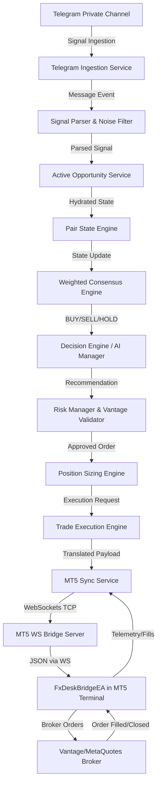

# FX Desk Pro — Execution Engine Baseline

This document defines the baseline technical architecture, completed milestones, test coverage, and validation results of the FX Desk Pro execution engine prior to initiating the Trade Intelligence phase.

---

## 🏗️ 1. Architecture Summary

FX Desk Pro is an autonomous, signal-driven algorithmic trading platform built using Node.js and MetaTrader 5. It integrates real-time communications, analytical validation pipelines, and an asynchronous execution bridge.

### Key Components:
1. **Ingestion & Parsing**: Connects via `gramjs` to private channels. Classifies messages (`NEW_SIGNAL`, `NOISE`, `CANCEL_SIGNAL`) using matching rules and extracts targets (entry, SL, TP) via programmatic parsing.
2. **Analysis Pipeline**:
   - **Pair State Engine**: Tracks prices, levels, and consensus metrics in MongoDB.
   - **Weighted Consensus**: Aggregates signals across advisors (e.g. Gemini, technical rules).
   - **Decision Engine**: Generates real-time recommendation entries.
3. **Risk & Sizing Engine**: Validates risk parameters against balance and ensures a minimum Risk-to-Reward Ratio (typically $\ge 1:1.5$). Filters sizes using lot calculation rules (Vantage limits: minimum 0.01 lot).
4. **MT5 Sync & Bridge**:
   - High-throughput WebSocket server running on port `8080`.
   - Formulates standard `OPEN_ORDER` and `CLOSE_ORDER` payloads.
   - Receives client updates (`ACCOUNT_SUMMARY`, `ORDER_FILLED`, `ORDER_CLOSED`) and reconciles them in MongoDB.
5. **MetaTrader 5 Expert Advisor (`FxDeskBridgeEA.mq5`)**: Runs on the MT5 terminal to receive socket messages, interact with the broker using standard MQL5 order execution, and stream terminal history events.

---

## 🏆 2. Completed Milestones

- **Milestone 1 — Core Infrastructure**: Implemented base logging, database schemas (MongoDB), and health endpoints.
- **Milestone 2 — Telegram Ingestion**: Implemented private channel client, message classification, and automatic parser rules.
- **Milestone 3 — Analysis Pipeline**: Built Pair State Engine, Weighted Consensus, and Mock/Gemini AI providers.
- **Milestone 4 — Risk, Sizing, and Validation**: Implemented Vantage broker rule validation, position sizing based on risk capital, and RRR checks.
- **Milestone 5 — WebSockets MT5 Bridge**: Designed and coded the WS server, EA network handshake, state updates, heartbeat monitoring, and message parsing.
- **Milestone 6 — Broker Execution**: Validated placement and filling of real market orders on MT5 Demo accounts.

---

## 🧪 3. Test Coverage

The platform has a comprehensive test suite containing **93 distinct test specifications**:
- **Unit Tests**:
  - `testPaperRiskManager.js`: Verifies RRR limit checks, stop calculations, and lot sizing logic.
  - `testPriceCache.js` & `testPriceMonitor.js`: Verifies Yahoo Finance price ingestion caching and retrieval.
- **Integration Tests**:
  - `testActiveOpportunities.js`: Verifies signal updates, state transitions, and database persistence.
  - `testDecisionEngine.js`: Asserts execution payload generation.
- **System/E2E Tests**:
  - `testMt5Bridge.js`: Verifies order execution WebSocket payloads, fill feedback loops, and manual/target closures.
  - `testE2EPipeline.js`: Evaluates end-to-end flow from message ingestion to payload translation.

All test suites execute clean and pass under standard testing baselines.

---

## 🔗 4. MT5 Bridge & Demo Execution Validation

The bridge was verified using the specialized `runRealDemoMarketExecution.js` script:
- **Broker**: MetaQuotes-Demo / Vantage Global Prime Demo.
- **Terminal Integration**: FxDeskBridgeEA.mq5 was deployed and connected to the backend.
- **Execution Validation**: Dispatched real market orders to the terminal and verified:
  - Broker accepts order successfully.
  - Position is open in MT5 terminal.
  - Bridge receives `ORDER_FILLED` event and logs the ticket ID.
  - Synchronization logic reflects active position status.
  - `ORDER_CLOSED` transitions recommendation to `SYNC_COMPLETE`.

---

## ⚠️ 5. Known Limitations

1. **Weekend Spread/Pricing Freeze**: MT5 pricing feeds (`TimeCurrent()`) freeze on weekends, causing `priceMonitoringScheduler` to fetch stale rates or stall updates.
2. **EA Reconnection Backoff**: MT5 EA has a fixed reconnect delay that may cause brief connectivity gaps on server restarts.
3. **Database Dependency during Handshake**: A total database outage originally blocked connection handshakes until bypass mechanisms were added.

---

## 🔮 6. Future Extension Points

1. **Trade Intelligence**: Adding cognitive AI models to perform real-time chart analysis and news correlation.
2. **Pending Orders Support**: Designing the EA protocol and backend payload serialization for `BUY_LIMIT`/`SELL_LIMIT` pending orders.
3. **Multi-Asset Routing**: Expanding consensus engine to support index/crypto CFDs alongside spot forex.
